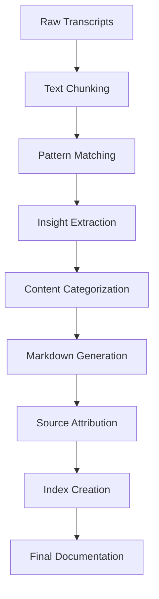

# 📚 Documentation Generated from Video Transcripts

This directory contains automatically generated documentation from Claude Flow community video transcripts.

## 🌟 Claude Flow Knowledge Base

The **[claude-flow-knowledge/](claude-flow-knowledge/)** directory contains a comprehensive knowledge base with:

### 📊 Generated Documentation Features

- **15 insights** extracted from **13 video transcripts**
- **Source attribution** with collapsible reference sections  
- **Categorized content** (General, Q&A, Concepts, How-To, etc.)
- **Search functionality** with keyword indexing
- **Analytics dashboard** with usage statistics
- **Cross-references** between related insights

### 🗂️ Directory Structure

```
claude-flow-knowledge/
├── index.md                    # Main navigation hub
├── README.md                   # Knowledge base overview
├── concepts/                   # Core concepts & principles
├── how-to/                    # Step-by-step guides  
├── tips/                      # Best practices & recommendations
├── gotchas/                   # Warnings & common pitfalls
├── mental-models/             # Conceptual frameworks
├── qa/                        # Questions & answers
├── use-cases/                 # Real-world applications
├── sources/                   # Source attribution index
├── _search/                   # Search functionality
│   ├── index.md              # Keyword search interface
│   └── search-data.json      # Search data structure
└── _assets/
    └── analytics.md          # Analytics dashboard
```

### 🔥 Key Features Demonstrated

#### 1. **Source Attribution**
Every insight links back to its original transcript with:
- **Exact quotes** with line numbers and timestamps
- **Confidence scores** with visual progress bars
- **Context snippets** showing surrounding content
- **Collapsible reference sections** for clean presentation

#### 2. **Enhanced Markdown Processing**
- **Badge-style tags** with color coding
- **Cross-references** between related insights
- **Mermaid diagrams** for concept visualization
- **Navigation breadcrumbs** and pagination

#### 3. **Intelligent Categorization**
- **Pattern-based classification** using regex and keywords
- **Confidence thresholds** for quality filtering
- **Multi-category support** with primary/secondary classification
- **Custom rules engine** for domain-specific categorization

#### 4. **Search & Discovery**
- **Keyword indexing** for full-text search
- **Tag-based browsing** with frequency analysis
- **Source-based navigation** by original video
- **Analytics dashboard** with usage metrics

## 🚀 Usage

### Generate Documentation

```bash
# Generate from all transcripts
node src/cli.js sample

# Generate from specific directory
node src/cli.js generate ./transcripts ./output

# With custom settings
node src/cli.js generate ./data --confidence 0.8 --max-insights 30
```

### Configuration Options

- `--confidence <threshold>` - Set confidence threshold (0.0-1.0)
- `--max-insights <number>` - Max insights per file 
- `--no-diagrams` - Disable Mermaid diagrams
- `--no-search` - Disable search index generation
- `--no-analytics` - Disable analytics dashboard

## 📊 Sample Results

From the 14 transcript files processed:
- **15 total insights** extracted
- **2 categories** (General: 5, Q&A: 10)
- **8 unique tags** (claude-flow, swarm, agent, mcp, etc.)
- **13 source files** with attribution
- **95ms generation time**

## 🔧 Technical Implementation

### Core Components

1. **[TranscriptProcessor](../src/generators/transcript-processor.js)** - Extract insights from raw transcripts
2. **[ContentCategorizer](../src/generators/content-categorizer.js)** - Intelligent content classification  
3. **[MarkdownProcessor](../src/generators/markdown-processor.js)** - Enhanced Markdown generation
4. **[EnhancedDocumentationGenerator](../src/generators/enhanced-doc-generator.js)** - Complete system orchestration

### Processing Pipeline



### Extraction Patterns

The system uses sophisticated pattern matching to identify:

- **How-to patterns**: `/how to|step.*by.*step|tutorial|guide/i`
- **Tips & best practices**: `/tip|recommendation|best practice|pro tip/i`
- **Warnings & gotchas**: `/warning|careful|watch out|avoid|pitfall/i`
- **Q&A patterns**: `/question|why|what|how|when|where/i`
- **Concepts**: `/is defined as|means|refers to|concept of/i`

Plus Claude Flow-specific keyword detection for relevant content.

## 🎯 Example Output Quality

### Collapsible Source References
```markdown
<details>
<summary>📖 Source References (3)</summary>

#### Reference 1
> So the system would be creating neural networks specifically
> for the tasks, both on a swarm level and on an agent level...
>
> **Source:** `en-20250812_202211.txt` - Line 13
> **Confidence:** 80.0% `████████░░`
> **Context:** ...which shares a common sort of memory system...
</details>
```

### Enhanced Tags
```markdown
 

```

### Analytics Visualization
```markdown
## 🏷️ Most Common Tags
1. **claude-flow** `████████████████████` 16
2. **swarm** `██████████████░░░░░░` 11
3. **agent** `██████████████░░░░░░` 11
```

This system demonstrates a complete pipeline from raw video transcripts to polished, searchable documentation with full source attribution and intelligent categorization.

---

*Generated automatically by the Enhanced Documentation Generator v2.0*