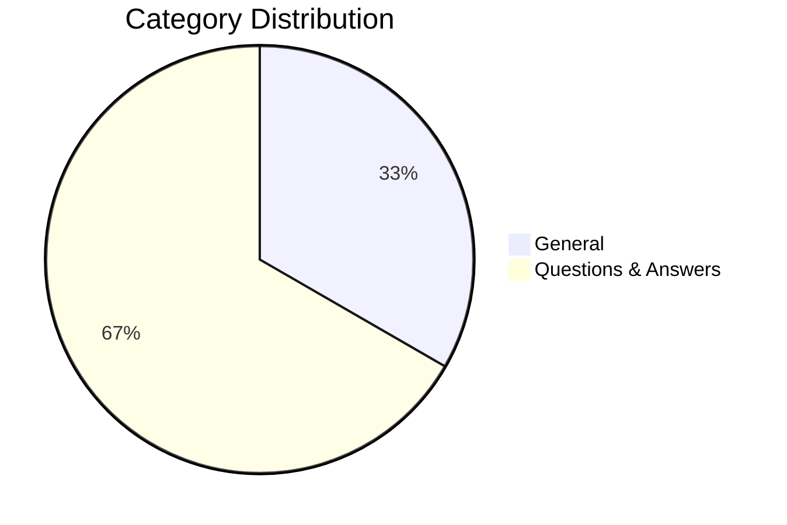

# 📊 Analytics Dashboard

Comprehensive analytics for the Claude Flow Knowledge Base.

## 📈 Overview

| Metric | Value |
|--------|-------|
| Total Insights | 15 |
| Categories | 2 |
| Sources | 13 |
| Unique Tags | 8 |
| Generation Time | NaNms |

## 📊 Category Distribution

## 🏷️ Most Common Tags

1. **claude-flow** `████████████████████` 16
2. **swarm** `██████████████░░░░░░` 11
3. **agent** `██████████████░░░░░░` 11
4. **mcp** `██████░░░░░░░░░░░░░░` 5
5. **orchestration** `████░░░░░░░░░░░░░░░░` 3
6. **neural** `███░░░░░░░░░░░░░░░░░` 2
7. **automation** `█░░░░░░░░░░░░░░░░░░░` 1
8. **workflow** `█░░░░░░░░░░░░░░░░░░░` 1

## 📹 Source Contributions

| Source | Insights | Percentage |
|--------|----------|------------|
| AI Hacker League July 10  Mastering Autonomous Agents with CloudFlow and Swarm Technology | 19 | 126.7% |
| Agentics Live Vibe Coding - June 19, 2025 | 19 | 126.7% |
| AI Hackerspace Live - July 25  Visualizing AI Swarms and Pushing the Boundaries of Agent Collaboration | 17 | 113.3% |
| AI Hackerspace Live July 11  The Rise of Swarm Intelligence and Autonomous Agents | 14 | 93.3% |
| AI Hackerspace Live - June 20  Swarm Development, AI Security, and Finland's AGI Preparation | 12 | 80.0% |
| AI Hackerspace August 1st  From CLI Aliases to Neural Networks - Advancing AI Engineering | 11 | 73.3% |
| Agentics Foundation (London Chapter) Meetup 13 Aug 25 - Edited | 11 | 73.3% |
| AI Hackerspace July 18  Optimizing Swarms, Visualizing Agents, and Democratizing AI Learning | 9 | 60.0% |
| AI Hackerspace August 8th  From Asteroid Games to AI-Powered Research Assistants | 8 | 53.3% |
| Toronto Chapter 2025-08-12 18-49-45 | 8 | 53.3% |

