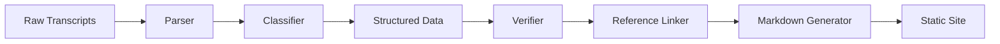

# Technical Specification - Claude Flow Tips Extraction System

## Architecture Overview

### Components
1. **Transcript Parser** - Extracts structured data from markdown transcripts
2. **Content Classifier** - Categorizes extracted snippets
3. **Reference Linker** - Creates GitHub-compatible source links
4. **Verification Engine** - Validates quotes and references
5. **Build System** - Generates final documentation site

## Data Pipeline



## Implementation Details

### 1. Transcript Parser (`scripts/parser.js`)
```javascript
class TranscriptParser {
  // Parse markdown transcript files
  // Extract potential content blocks
  // Identify speaker changes and timestamps
  // Return structured JSON data
}
```

**Input**: Markdown transcript files
**Output**: JSON with extracted segments and metadata

### 2. Content Classifier (`scripts/classifier.js`)
```javascript
class ContentClassifier {
  // Analyze text for category keywords
  // Apply NLP for context understanding
  // Score confidence levels
  // Assign primary and secondary categories
}
```

**Categories Detection Patterns**:
- Gotcha: "warning", "careful", "don't", "avoid", "dangerous"
- Tip: "recommend", "suggest", "better", "should", "best practice"
- How To: "steps", "first", "then", "setup", "configure"
- Q&A: Question marks, "asked", "answer", "response"

### 3. Reference Linker (`scripts/linker.js`)
```javascript
class ReferenceLinker {
  // Generate GitHub markdown links
  // Format: [text](../transcripts/file.md#L10-L15)
  // Validate line numbers exist
  // Create bidirectional links
}
```

### 4. Verification Engine (`scripts/verifier.js`)
```javascript
class Verifier {
  // Check quote accuracy against source
  // Validate all links resolve
  // Ensure minimum context included
  // Generate verification report
}
```

### 5. Build System (`scripts/build.js`)
```javascript
class Builder {
  // Aggregate verified content
  // Generate category pages
  // Build search index
  // Create navigation structure
  // Output static site
}
```

## File Formats

### Transcript Format
```markdown
# Video Title - [Date]
## Transcript

[Speaker 1]: [Timestamp] 
Content line 1
Content line 2

[Speaker 2]: [Timestamp]
Response content
```

### Extracted Entry Format (JSON)
```json
{
  "id": "gotcha-001",
  "category": "gotcha",
  "title": "Permissions Warning",
  "summary": "Never run with --dangerously-skip-permissions locally",
  "content": "Full explanation...",
  "sources": [
    {
      "file": "video-001.md",
      "lines": [45, 52],
      "quote": "Exact quote from transcript"
    }
  ],
  "related": ["tip-003", "howto-007"],
  "metadata": {
    "extracted": "2024-01-15",
    "verified": true,
    "confidence": 0.95
  }
}
```

## Automation & CI/CD

### GitHub Actions Workflow
```yaml
name: Extract and Verify
on:
  push:
    paths:
      - 'transcripts/*.md'
  schedule:
    - cron: '0 0 * * MON'  # Weekly update

jobs:
  extract:
    runs-on: ubuntu-latest
    steps:
      - uses: actions/checkout@v3
      - name: Run extraction
      - name: Verify references
      - name: Build documentation
      - name: Deploy to GitHub Pages
```

### Pre-commit Hooks
- Validate markdown syntax
- Check reference links
- Verify quote accuracy
- Format consistency

## Search Implementation

### Client-side Search with Lunr.js
```javascript
// Build search index during build process
const searchIndex = lunr(function() {
  this.field('title', { boost: 10 })
  this.field('category', { boost: 5 })
  this.field('content')
  this.field('tags')
  
  // Add all entries to index
});
```

### Search UI Features
- Real-time results as you type
- Filter by category
- Sort by relevance/date
- Highlight matching terms

## Verification Dashboard

### Metrics Tracked
- Total entries extracted
- Verification status per entry
- Source coverage percentage
- Broken link detection
- Update frequency

### Verification Report Format
```markdown
# Verification Report - [Date]

## Summary
- Total Entries: 145
- Verified: 142 (97.9%)
- Pending: 3
- Failed: 0

## Details
[Table of entries with status]

## Issues
[List of any problems found]
```

## API Endpoints (Optional Future Enhancement)

### REST API for Programmatic Access
```
GET /api/entries          # List all entries
GET /api/entries/:id      # Get specific entry
GET /api/categories       # List categories
GET /api/search?q=term    # Search entries
GET /api/verify/:id       # Verify entry sources
```

## Performance Requirements

- Extraction: Process 100-page transcript in <10 seconds
- Verification: Check 1000 references in <30 seconds
- Build: Generate full site in <60 seconds
- Search: Return results in <100ms
- Page Load: Initial load <2 seconds

## Security Considerations

- Sanitize all user inputs in search
- Validate markdown to prevent XSS
- Rate limit API endpoints
- No execution of code from transcripts
- Static site deployment (no server-side execution)

## Testing Strategy

### Unit Tests
- Parser accuracy
- Classifier categorization
- Link generation
- Quote extraction

### Integration Tests
- End-to-end pipeline
- Build process
- Search functionality
- Link validation

### Manual Testing
- Review sample extractions
- Verify category assignments
- Check user experience
- Validate accessibility

## Deployment

### Hosting Options
1. **GitHub Pages** (Recommended)
   - Free hosting
   - Automatic deployment
   - Version control integration

2. **Netlify/Vercel** (Alternative)
   - Better performance
   - Preview deployments
   - Advanced features

### Domain Configuration
- Primary: `tips.claudeflow.com` (if available)
- Fallback: `username.github.io/claude-flow-tips`

## Monitoring & Analytics

### Metrics to Track
- Page views by category
- Search queries
- 404 errors (broken links)
- Time on page
- User journey paths

### Tools
- Google Analytics 4
- GitHub Insights
- Custom verification dashboard
- Automated link checker

## Future Enhancements

### Phase 2 Features
- Video timestamp links
- Interactive examples
- Community contributions
- RSS feed for updates
- Email notifications

### Phase 3 Features
- AI-powered categorization
- Automatic transcript generation
- Multi-language support
- Integration with Claude Flow CLI
- VS Code extension