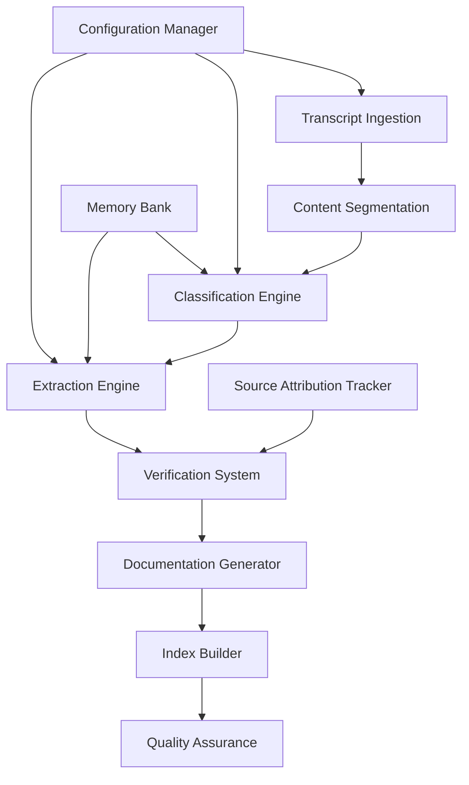

# System Architecture Design: Claude Flow Knowledge Extractor

## 1. Executive Summary

This document outlines the system architecture for extracting, structuring, and verifying knowledge from Claude Flow community video transcripts. The system follows the SPARC methodology (Specification, Pseudocode, Architecture, Refinement, Completion) and implements a multi-stage pipeline for transforming unstructured video content into searchable, verifiable documentation.

### Key Architectural Decisions
- **Event-driven pipeline architecture** for scalable processing
- **Multi-layered verification system** to prevent hallucinations
- **Source attribution mechanism** with line-level traceability
- **Modular component design** for maintainability and testing

## 2. System Overview

### 2.1 Architecture Pattern
The system implements a **Pipeline Architecture** with the following characteristics:
- Sequential processing stages with clear interfaces
- Event-driven communication between components
- Fail-fast validation at each stage
- Comprehensive logging and monitoring

### 2.2 Quality Attributes
- **Accuracy**: 95% quote verification against source transcripts
- **Scalability**: Process 100+ transcripts concurrently
- **Maintainability**: Modular design with clear separation of concerns
- **Traceability**: Full source attribution with line-level references
- **Performance**: Process typical transcript (30-60 minutes) in under 5 minutes

## 3. Pipeline Components

### 3.1 Component Overview



### 3.2 Detailed Component Specifications

#### 3.2.1 Transcript Ingestion Component

**Purpose**: Parse and normalize input transcript files
**Location**: `src/processors/transcript-processor.js`

**Responsibilities**:
- Support multiple formats (.vtt, .srt, .txt)
- Extract timestamps and speaker information
- Normalize text encoding and line breaks
- Generate unique content identifiers

**Input**: Raw transcript files
**Output**: Normalized transcript objects with metadata

```javascript
{
  id: "transcript_uuid",
  filename: "source_file.txt", 
  content: [
    {
      line_number: 1,
      timestamp: "00:12:34",
      speaker: "host",
      text: "So the really important thing..."
    }
  ],
  metadata: {
    duration: "45:30",
    language: "en",
    processed_at: "2025-08-22T10:30:00Z"
  }
}
```

#### 3.2.2 Content Segmentation Component

**Purpose**: Divide transcript into logical chunks for processing
**Location**: `src/processors/content-segmenter.js`

**Segmentation Strategy**:
- **Topic boundaries**: Detect topic changes using semantic similarity
- **Speaker transitions**: Segment on speaker changes for Q&A content
- **Time-based chunking**: Maximum 500 words per segment
- **Context preservation**: Maintain 50-word overlap between segments

**Output**: Segmented content blocks with context metadata

#### 3.2.3 Classification Engine

**Purpose**: Categorize content into predefined knowledge types
**Location**: `src/extractors/content-classifier.js`

**Categories Based on Transcript Analysis**:
1. **How-To Guides**: Step-by-step instructions (e.g., "Setting Up Claude Flow in Codespaces")
2. **Tips & Best Practices**: Optimization suggestions (e.g., "Use containerized environments")
3. **Gotchas & Pitfalls**: Warnings and common mistakes (e.g., "Authentication failures")
4. **Mental Models**: Conceptual frameworks (e.g., "Wardley Maps for AI Development")
5. **Q&A Content**: Community questions and answers
6. **Technical Insights**: Architecture and implementation details
7. **Use Cases**: Real-world application examples

**Classification Algorithm**:
- Multi-label classification using transformer models
- Confidence scoring for each category
- Human-in-the-loop validation for low-confidence predictions

#### 3.2.4 Extraction Engine

**Purpose**: Extract structured insights from classified content
**Location**: `src/extractors/insight-extractor.js`

**Extraction Rules**:
- **Title Generation**: Concise, action-oriented titles (max 80 characters)
- **Summary Creation**: 50-200 word summaries with key takeaways
- **Quote Selection**: Most relevant 1-3 sentences that support the insight
- **Context Preservation**: Surrounding context for quote interpretation

**Template-Based Extraction**:
```javascript
const extractionTemplates = {
  'how-to': {
    titlePattern: /^(how to|setting up|configuring)/i,
    requiredElements: ['steps', 'prerequisites', 'outcome'],
    minSteps: 3
  },
  'gotcha': {
    titlePattern: /^(warning|be careful|avoid|don't)/i,
    requiredElements: ['problem', 'impact', 'solution'],
    severity: ['low', 'medium', 'high', 'critical']
  }
}
```

#### 3.2.5 Verification System

**Purpose**: Ensure accuracy and prevent hallucinations
**Location**: `src/validators/content-verifier.js`

**Multi-Layer Verification**:

1. **Quote Validation Layer**:
   - Exact match verification against source transcript
   - Fuzzy matching for minor transcription errors
   - Context window validation (±2 sentences)

2. **Consistency Checking Layer**:
   - Cross-reference similar insights across transcripts
   - Detect contradictory information
   - Validate technical accuracy against known facts

3. **Confidence Scoring Layer**:
   - Source quote confidence (0.0-1.0)
   - Classification confidence (0.0-1.0)
   - Overall insight confidence (weighted average)

**Verification Thresholds**:
- **Auto-approve**: Confidence > 0.90
- **Human review**: Confidence 0.70-0.90
- **Reject**: Confidence < 0.70

#### 3.2.6 Source Attribution Mechanism

**Purpose**: Maintain complete traceability to source material
**Location**: `src/validators/source-attribution.js`

**Attribution Data Structure**:
```javascript
{
  insight_id: "unique_uuid",
  source_references: [
    {
      file: "transcript_filename.txt",
      line_start: 234,
      line_end: 237,
      timestamp: "00:12:34",
      exact_quote: "Direct quote from transcript...",
      context_before: "Previous sentence for context",
      context_after: "Following sentence for context",
      confidence: 0.95,
      verification_method: "exact_match"
    }
  ],
  derived_references: [
    {
      insight_id: "related_insight_uuid",
      relationship: "supports|contradicts|extends"
    }
  ]
}
```

**Traceability Features**:
- **Immutable source links**: References cannot be modified without audit trail
- **Version tracking**: Track changes to source transcripts
- **Audit logging**: Record all verification decisions
- **Backtracking capability**: From any generated content to original source

## 4. Data Flow Architecture

### 4.1 Processing Flow

```
[Input Transcripts] 
    ↓ (File System Events)
[Transcript Processor]
    ↓ (Normalized Transcript)
[Content Segmenter]
    ↓ (Segmented Content)
[Parallel Processing]
    ├── [Classifier] ────┐
    ├── [Extractor] ─────┤
    └── [Attribution] ───┤
    ↓ (Classified Insights)  ↓
[Verification System] ←──────┘
    ↓ (Verified Insights)
[Documentation Generator]
    ↓ (Markdown Files)
[Index Builder]
    ↓ (Search Index)
[Quality Assurance Dashboard]
```

### 4.2 Error Handling Flow

```
[Processing Error] 
    ↓
[Error Classification]
    ├── Recoverable → [Retry with Backoff]
    ├── Data Quality → [Quality Queue]
    └── System Error → [Alert & Log]
    
[Quality Queue]
    ├── Low Confidence → [Human Review]
    ├── Missing Context → [Reprocess with More Context]
    └── Validation Failure → [Manual Investigation]
```

## 5. System Integration Points

### 5.1 External Dependencies

1. **AI/ML Services**:
   - **Primary LLM**: Claude 3.5 Sonnet for content understanding
   - **Embedding Service**: OpenAI text-embedding-3-large for semantic similarity
   - **Classification**: Fine-tuned BERT for category classification

2. **Storage Systems**:
   - **File Storage**: Local filesystem for transcripts and generated docs
   - **Metadata DB**: SQLite for relationships and attribution
   - **Search Index**: Elasticsearch for full-text search

3. **Monitoring & Observability**:
   - **Logging**: Structured logging with correlation IDs
   - **Metrics**: Processing times, accuracy rates, error counts
   - **Alerting**: Quality threshold violations, processing failures

### 5.2 Configuration Management

**Location**: `config/system-config.json`

```javascript
{
  "processing": {
    "max_concurrent_transcripts": 5,
    "segment_overlap_words": 50,
    "max_segment_words": 500,
    "confidence_thresholds": {
      "auto_approve": 0.90,
      "human_review": 0.70,
      "reject": 0.70
    }
  },
  "categories": {
    "how_to": {
      "min_steps": 3,
      "max_summary_words": 200,
      "required_elements": ["steps", "outcome"]
    },
    "gotcha": {
      "severity_levels": ["low", "medium", "high", "critical"],
      "required_elements": ["problem", "impact", "solution"]
    }
  },
  "attribution": {
    "context_window_sentences": 2,
    "min_quote_length": 20,
    "max_quote_length": 300
  }
}
```

## 6. Quality Assurance Architecture

### 6.1 Validation Pipeline

```
[Content Validation]
├── Structural Validation
│   ├── Required fields present
│   ├── Data type validation
│   └── Length constraints
├── Semantic Validation  
│   ├── Quote accuracy verification
│   ├── Category appropriateness
│   └── Summary coherence
└── Business Rule Validation
    ├── Source attribution completeness
    ├── Confidence threshold compliance
    └── Duplication detection
```

### 6.2 Quality Metrics

**Accuracy Metrics**:
- Quote verification rate: Target 95%
- Category classification accuracy: Target 90%
- Hallucination detection rate: Target 99%

**Performance Metrics**:
- Processing time per transcript: Target <5 minutes
- Throughput: Target 20 transcripts/hour
- System availability: Target 99.9%

**Quality Metrics**:
- Human review required rate: Target <10%
- Documentation completeness: Target 95%
- User satisfaction score: Target >4.0/5.0

## 7. Security & Privacy Considerations

### 7.1 Data Protection
- **Input Sanitization**: Validate all transcript inputs
- **Output Filtering**: Remove potential sensitive information
- **Access Controls**: Role-based access to processing components
- **Audit Logging**: Comprehensive activity logging

### 7.2 AI Safety Measures
- **Hallucination Detection**: Multi-layer verification system
- **Bias Monitoring**: Regular evaluation of extraction bias
- **Content Filtering**: Remove inappropriate or harmful content
- **Human Oversight**: Review queue for edge cases

## 8. Deployment Architecture

### 8.1 Development Environment
```
Local Development
├── Docker Compose Setup
├── Mock Data Pipeline
├── Unit Test Suite
└── Integration Test Environment
```

### 8.2 Production Environment
```
Production Deployment
├── Containerized Services
├── Load Balancer
├── Auto-scaling Groups
├── Monitoring Stack
└── Backup & Recovery
```

## 9. Architecture Decision Records (ADRs)

### ADR-001: Pipeline vs Microservices Architecture
**Decision**: Use pipeline architecture over microservices
**Rationale**: 
- Simpler deployment and debugging
- Sequential processing fits the problem domain
- Lower operational complexity
- Easier to ensure data consistency

### ADR-002: SQLite vs PostgreSQL for Metadata
**Decision**: Use SQLite for metadata storage
**Rationale**:
- Sufficient for expected data volume
- Simpler deployment (no external database)
- File-based storage aligns with document generation
- Easy backup and version control

### ADR-003: Real-time vs Batch Processing
**Decision**: Implement batch processing with near-real-time capabilities
**Rationale**:
- Transcripts are typically processed after video publication
- Batch processing allows for better resource utilization
- Quality validation benefits from complete transcript analysis
- Can add real-time capabilities later if needed

## 10. Implementation Roadmap

### Phase 1: Core Pipeline (Weeks 1-2)
- Implement transcript processor and content segmenter
- Build basic classification and extraction engines
- Create simple verification system
- Generate basic Markdown output

### Phase 2: Quality & Verification (Weeks 3-4)
- Implement comprehensive verification system
- Add source attribution mechanism
- Build quality assurance dashboard
- Create human review workflow

### Phase 3: Search & Discovery (Weeks 5-6)
- Build search index and API
- Implement cross-reference system
- Add related content suggestions
- Create navigation and browsing tools

### Phase 4: Production Readiness (Weeks 7-8)
- Add monitoring and alerting
- Implement error handling and recovery
- Create deployment automation
- Conduct performance optimization

## 11. Success Metrics & Monitoring

### 11.1 Key Performance Indicators
- **Processing Accuracy**: 95% quote verification rate
- **Processing Speed**: <5 minutes per 1-hour transcript
- **Content Coverage**: 90% of key insights extracted
- **User Adoption**: 80% user satisfaction with documentation

### 11.2 Monitoring Strategy
- **Real-time Dashboards**: Processing status, error rates, quality metrics
- **Automated Alerts**: Quality threshold violations, processing failures
- **Regular Reports**: Weekly quality summaries, monthly trend analysis
- **User Feedback**: Integrated feedback collection and analysis

## 12. Risk Mitigation Strategies

### 12.1 Technical Risks
- **AI Hallucinations**: Multi-layer verification, human review queues
- **Performance Bottlenecks**: Horizontal scaling, caching strategies
- **Data Quality Issues**: Input validation, quality scoring, manual review

### 12.2 Operational Risks
- **Single Points of Failure**: Redundancy, backup systems, graceful degradation
- **Scalability Limits**: Auto-scaling, resource monitoring, capacity planning
- **Maintenance Overhead**: Automated testing, deployment pipelines, monitoring

---

## Conclusion

This architecture provides a robust, scalable foundation for extracting and structuring knowledge from Claude Flow community transcripts. The pipeline-based design ensures data quality and traceability while maintaining flexibility for future enhancements. The multi-layered verification system addresses the critical requirement of preventing AI hallucinations, and the comprehensive source attribution mechanism ensures full traceability to original content.

The modular design enables independent development and testing of components, while the quality-first approach ensures reliable, accurate documentation generation. This architecture positions the system for successful deployment and long-term maintenance of the Claude Flow knowledge base.